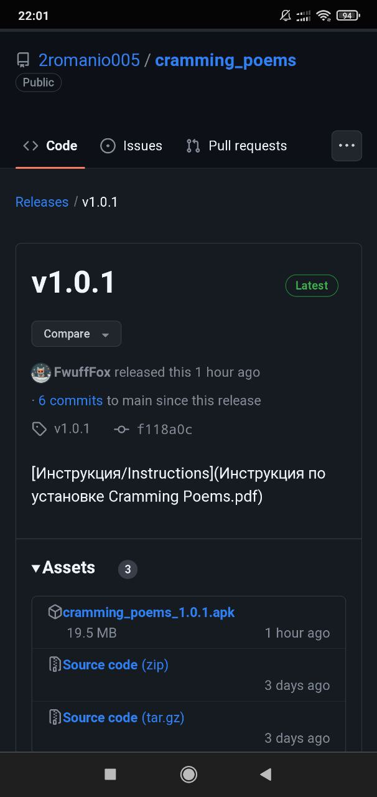
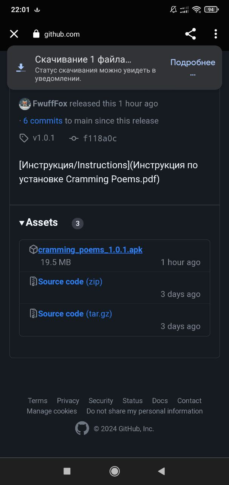
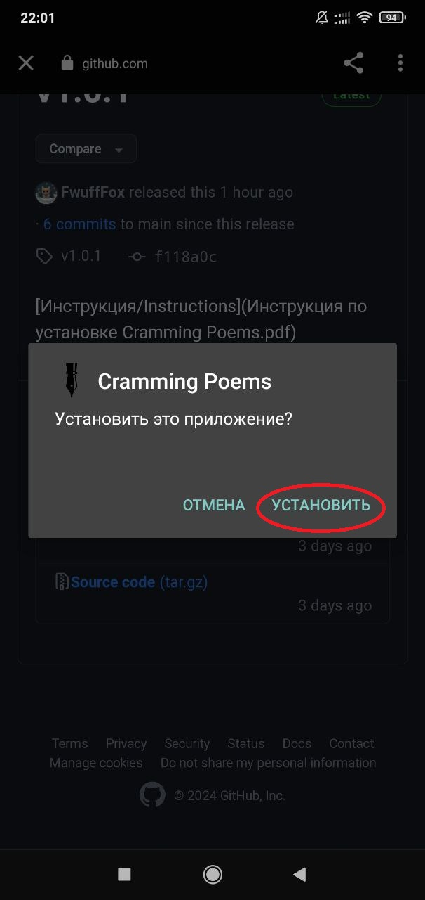
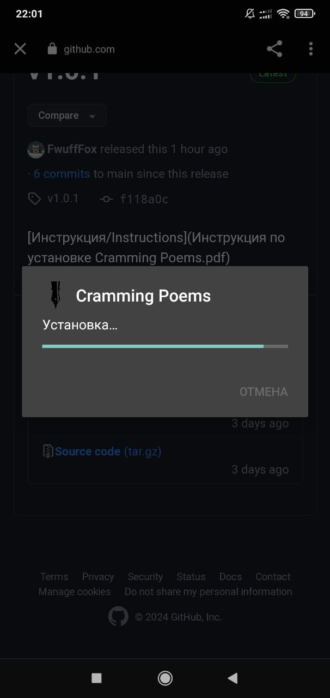
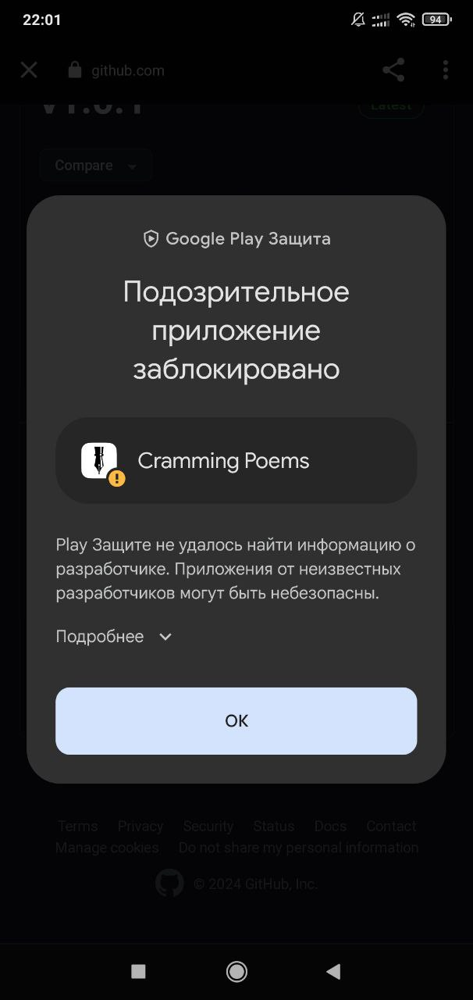
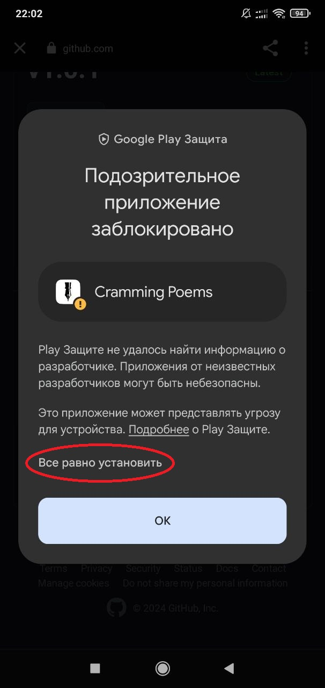
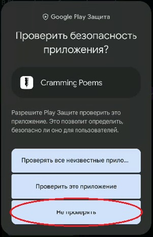
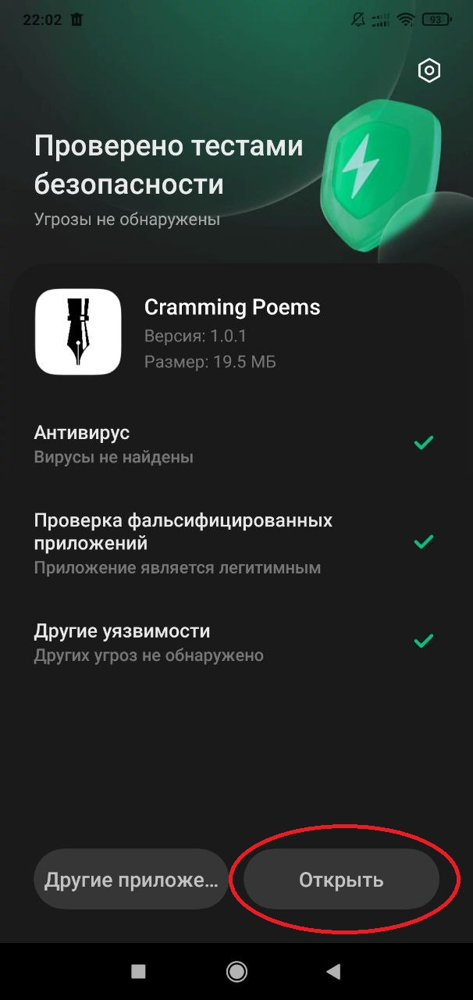
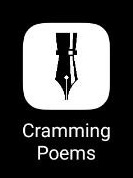

## Инструкция по установке Cramming Poems

### Нажимайте на то что обведено красным.

1. Переходим по ссылке на последнюю версию приложения

	https://github.com/2romanio005/cramming_poems/releases/latest
	
	Вы увидите:
	
	

1. Начните скачку установочного файла

	

1. Дождаться скачивания

	

1. Нажимаем *“Установить”*

	

	Если высветится требование "разрешить установку из неизвестных источников" - разрешаем. Инструкцию по ссылке, но вроде там всё очевидно.

		https://mi-check.ru/ustanovka-iz-neizvestnyx-istochnikov-v-miui-12/

		В конце должно выглядеть так
			
		
		
		После изменения настроек - снова открываем установочный файл

1. Начинается установка - *ничего* не нажимаем

	

1. Google Play Защита пытается нас остановить – нажимаем *“подробнее”*

	

1. Для продолжения установки нажимам *“Всё равно установить”*

	

1. Если появляется такое окно (появляется не всегда) нажимаем *“Не проверять”*

	

1. Приложение провериться, и после этого установка должна быть завершена, вы можете *“открыть”* приложение

	

1. На рабочем столе появится *иконка* приложения 

	
	

