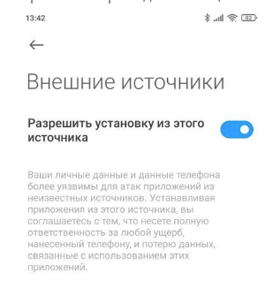
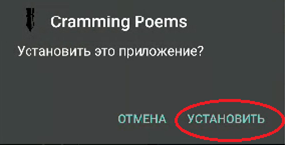
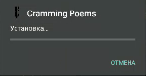
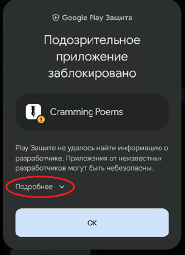
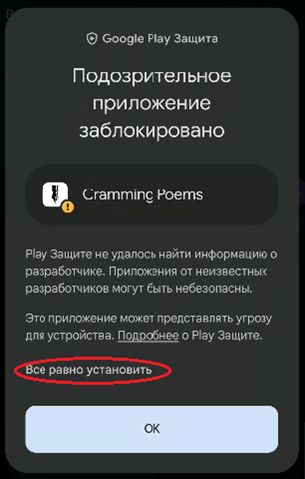
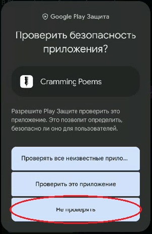
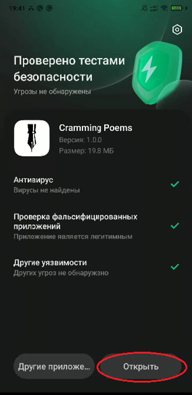
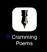

## Инструкция по установке Cramming Poems

### Нажимайте на то что обведено красным.

1. Скачать установочный файл

	

1. Открыть установочный файл

1. Если высветится требование разрешить установку из неизвестных источников проходим по ссылке на инструкцию

	https://mi-check.ru/ustanovka-iz-neizvestnyx-istochnikov-v-miui-12/

	В конце должно выглядеть так
		
	
				
	
	
	И снова открываем установочный файл

1. Нажимаем *“Установить”*

	

1. Начинается установить - *ничего* не нажимаем

	

1. Google Play Защита пытается нас остановить – нажимаем *подробнее*

	

1. Для продолжения установки нажимам *“Всё равно установить”*

	

1. Если появляется такое окно (появляется не всегда) нажимаем *“Не проверять”*

	

1. Приложение провериться, и после этого установка должна быть завершена, вы можете *открыть* приложение

	

1. На рабочем столе появится *иконка* приложения 

	
	

