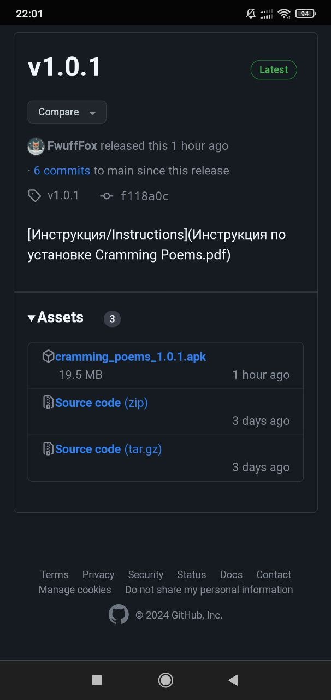

## Инструкция по установке Cramming Poems

### Нажимайте на то что обведено красным.

1. Переходим по ссылке на последнюю версию приложения

	https://github.com/2romanio005/cramming_poems/releases/latest
	
	Вы увидите:
	
	{width=100}

1. Начните скачку установочного файла

	{width=200 height=100}

1. Дождаться скачивания

	

1. Нажимаем *“Установить”*

	

1. Если высветится требование "разрешить установку из неизвестных источников" - разрешаем. Инструкцию по ссылке, но вроде там всё очевидно.

	https://mi-check.ru/ustanovka-iz-neizvestnyx-istochnikov-v-miui-12/

	В конце должно выглядеть так
		
	
	
	После изменения настроек - снова открываем установочный файл

1. Начинается установить - *ничего* не нажимаем

	

1. Google Play Защита пытается нас остановить – нажимаем *подробнее*

	

1. Для продолжения установки нажимам *“Всё равно установить”*

	

1. Если появляется такое окно (появляется не всегда) нажимаем *“Не проверять”*

	

1. Приложение провериться, и после этого установка должна быть завершена, вы можете *открыть* приложение

	

1. На рабочем столе появится *иконка* приложения 

	
	

