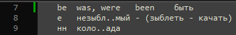

# Заучиватель слов (Консольное для Windows)

&emsp;&emsp;Подходит для заучивания слов перед диктантом: словарные слова, неправильные формы глаголов, ударения, исключения.\
&emsp;&emsp;После правильного ответа на вопрос к прогрессу слова добавляется 1, после неправильно ответа - вычитается 1. Слово считается выученным, если его прогресс достиг какого-то числа, которое вы задаёте.

## Фото работы

1. Выбор файла с исходыми данными и некоторых настроек

	

1. Список всех слов и их прогресс заучивания

	

1. Программа задаёт вопрос

	

1. Дан неправильный ответ. Выводится правильный ответ, ваш ответ, и правило, аналогий или подсказка, если вы их указывали

	

## Формат входных данных

&emsp;&emsp;Одна строчка - один пункт заучивания. В каждой строчке должно быть записано несколько слов или фраз (далее слов), разделённых каким-то разделителем. 
Разделитель должен быть одинаковым для всех строчек. 
Слово после последнего разделителя будет выводится как вопрос, остальные слова надо будет ввести через тот же разделитель как ответ.
Можно оставить подсказку с помощью знака -, вся строка после тире считается подсказкой и будет показываться при неправильном ответе.\

&emsp;&emsp;В качестве разделителя удобно использовать табуляцию.

## Заключение

Написано на C++, Консольное приложение. 20--г. Я переписывал это приложение кучу раз.

 ${\color{yellow}TODO}$ 1) Добавить возможность подписывать комментарий к слову после ответа на это слово.\
 