# Лабораторная работа 1. HA Postgres Cluster

Выполнил: Проскуряков Роман Владимирович

## Часть 1. Поднимаем Postgres

<details>
  <summary>Dockerfile</summary>

```
 FROM postgres:15

# Ставим нужные для Patroni зависимости
RUN apt-get update -y && \
	apt-get install -y netcat-openbsd python3-pip curl python3-psycopg2 python3-venv iputils-ping

# Используем виртуальное окружение, доустанавливаем, собственно, Patroni
RUN python3 -m venv /opt/patroni-venv && \
	/opt/patroni-venv/bin/pip install --upgrade pip && \
	/opt/patroni-venv/bin/pip install patroni[zookeeper] psycopg2-binary

# Копируем конфигурацию для двух узлов кластера Patroni
COPY postgres0.yml /postgres0.yml
COPY postgres1.yml /postgres1.yml

ENV PATH="/opt/patroni-venv/bin:$PATH"

USER postgres

#CMD не задаем, т.к. все равно будем переопределять его далее в compose
```
</details>

<details>
  <summary>Конечный docker-compose.yml</summary>

```
```
</details>

<details>
  <summary>postgres0.yml</summary>

```
```
</details>

<details>
  <summary>postgres1.yml</summary>

```
```
</details>

<details>
  <summary>haproxy.cfg</summary>

```
```
</details>

Собираем докер образ из докер файла
	
`docker build --no-cache -f Dockerfile -t localhost/postgres:patroni .`

[]()

Запустим контейнеры через docker compose

`docker compose up -d`

Эта команда запустит:
* pg-master (Postgres + Patroni, порт 5433)
* pg-slave (Postgres + Patroni, порт 5434)
* zoo (Zookeeper, порт 2181)

`docker compose ps`

[]()

Узнаём какая из нод стала главной:

`docker compose logs pg-master | grep leader`

`docker compose logs pg-slave | grep leader`

[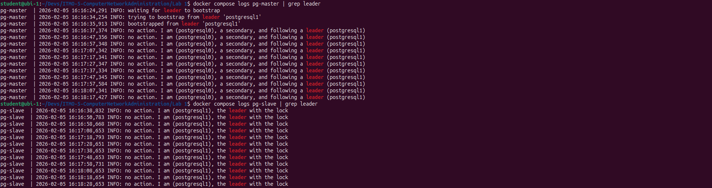]()

Основной является *pg-slave*

Проверяем, что зукипер запустился

`docker logs zoo | grep 2181`

[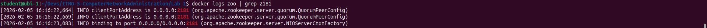]()

### Вопрос о разнице между expose и ports в Docker Compose
expose делает порт доступным только для других контейнеров в той же сети Docker, но не публикует его на хост-машине. ports публикует порт на хост-машине, позволяя внешним подключениям. В данной лабораторной порт 8008 используется Patroni для внутреннего API, поэтому его достаточно экспонировать только между контейнерами. Порты 5433 и 5434 проброшены на хост для подключения клиентов к БД.

### Вопрос о пересборке образа при изменениях в Docker Compose
При обычном docker-compose up образ не пересобирается, если он уже существует. Если изменить файлы postgresX.yml, которые копируются в образ через COPY в Dockerfile, потребуется пересборка с docker-compose up --build. Если же изменить только содержимое Dockerfile, пересборка также потребуется. Однако если конфигурационные файлы монтируются через volumes, изменения применяются без пересборки.

# Часть 2 Проверяем репликацию

Подключаемся к основной бд (pg-slave) и редиактируем её

```
CREATE TABLE test_table (id int, data varchar);
INSERT INTO test_table VALUES('2', 'data for replic');
SELECT * FROM test_table
```

Изменения прошли успешно.

[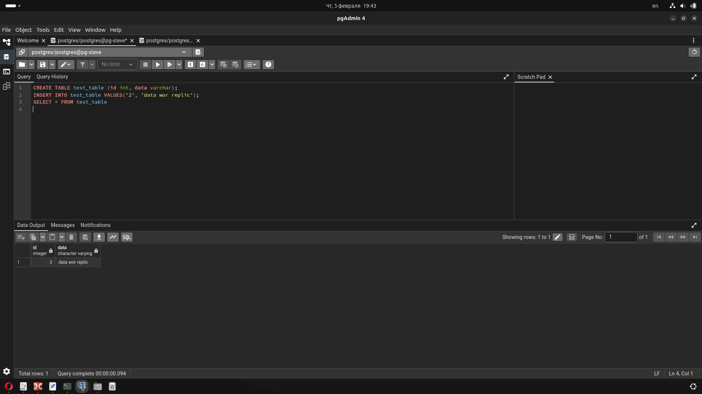]()

Проверяем на реплике (pg-master).

`SELECT * FROM test_table`

Получили те же данные.

[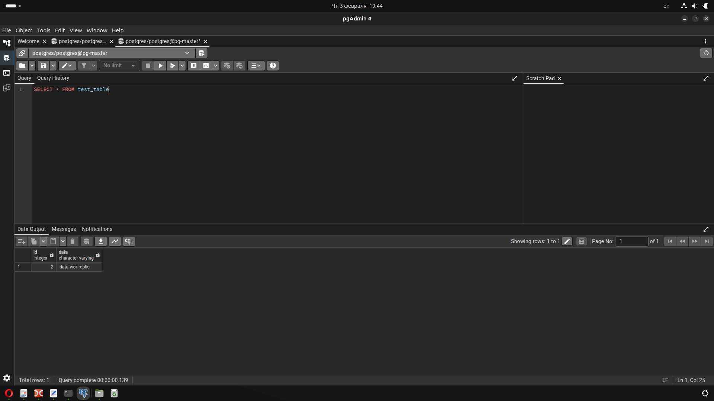]()

Пробуем изменить реплику (pg-master) напрямую

`INSERT INTO test_table VALUES('3', 'data error')`

Получаем ошибку:
`ERROR:  cannot execute INSERT in a read-only transaction`

[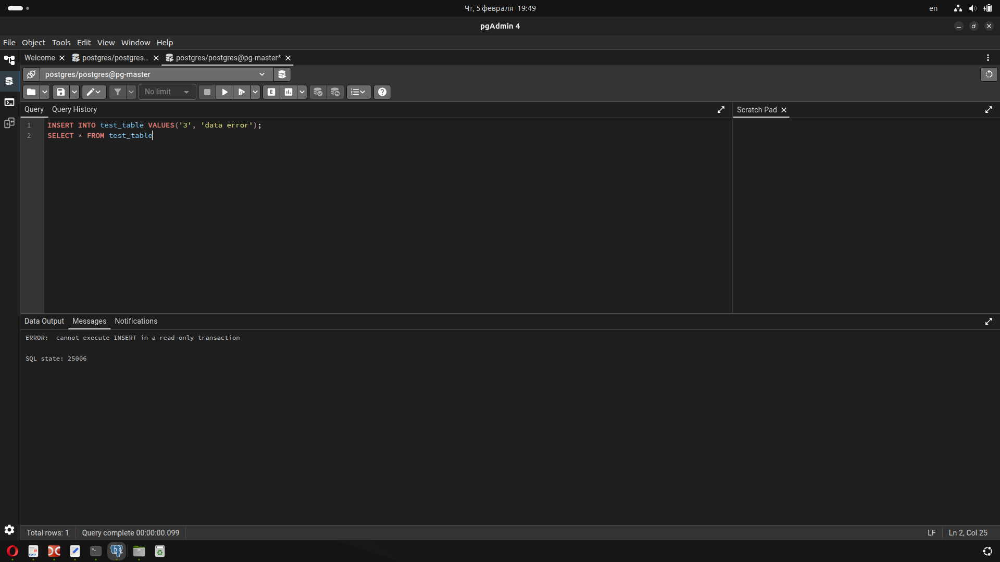]()

# Часть 3 Делаем высокую доступность

Перезапускаем проект после изменений в `docker-compose.yml`. Для этого:

Удаляем ранее поднятые контейнеры

`docker compose down`

И запускаем заново
`docker compose up -d`

и проверяем, что всё работает так же как до этого.

[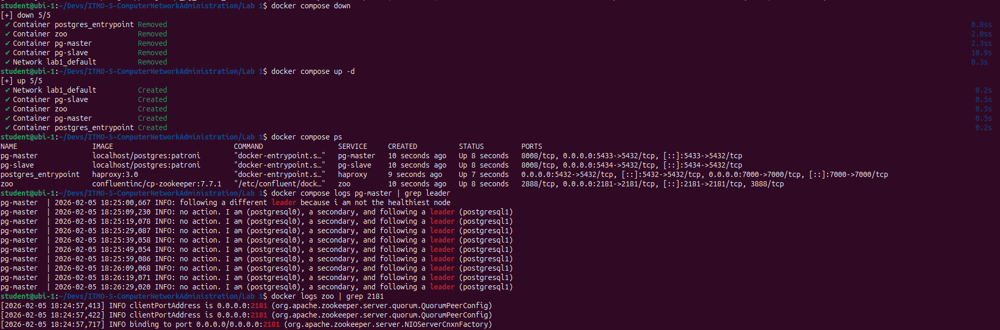]()

Через несколько секунд проверяем, что HAproxy тоже начал работать

`docker logs postgres_entrypoint`

[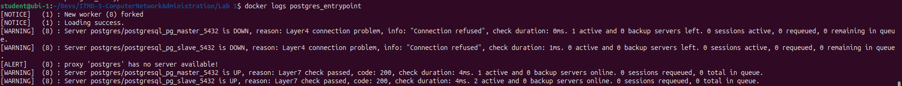]()

Проверяем что через порт HAProxy получаем те же данные, что записаны в бд.

[]()

Принудительно отключаем ноду текущего мастера (pg-slave):

`docker stop pg-slave`

[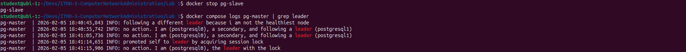]()

И видим, что реплика перехватила подхватила работу и стала лидирующей нодой.

Пытаемся добавить новую таблицу sql. Она добавляется на единственную активную ноду.

[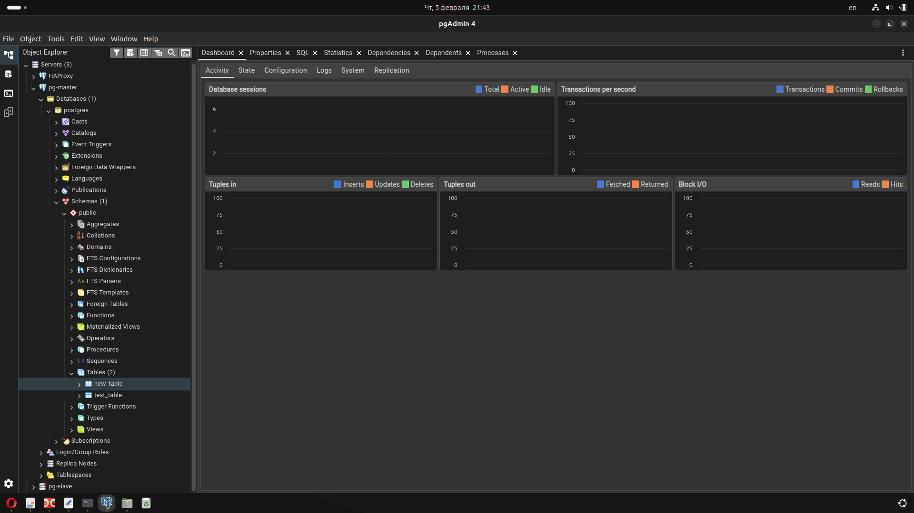]()

Запускаем старого мастера (pg-slave) обратно

`docker start pg-slave`

[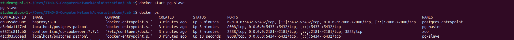]()

Проверяем, что он получил изменения, сделанные в моменте пока он не работал.

[]()

Теперь старый масте стал репликой. Роли поменялись местами.

[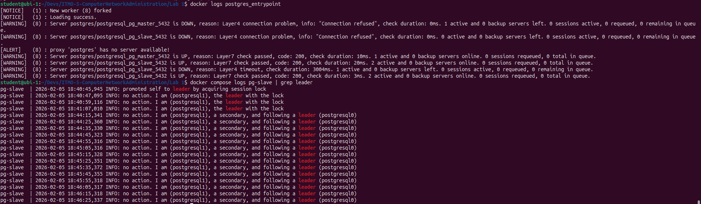]()

## Вывод

В ходе работы был успешно развернут отказоустойчивый кластер PostgreSQL. Использование Patroni в связке с ZooKeeper позволило автоматизировать процесс перевыборов лидера при отказе, а HAProxy обеспечил прозрачное для пользователя переключение между узлами. Кластер сохраняет работоспособность и целостность данных даже при выходе из строя одного из серверов БД. Однако приходится платить за это избыточностью данных.