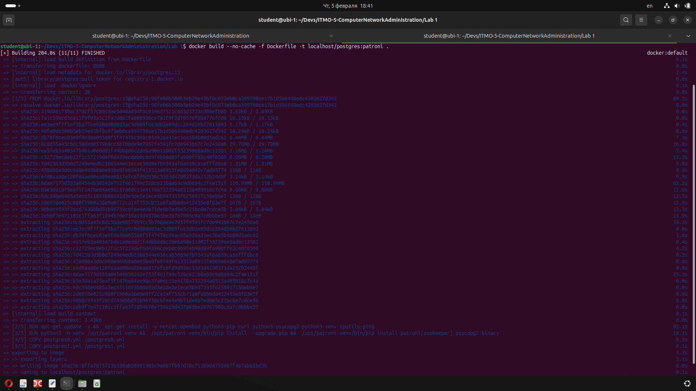
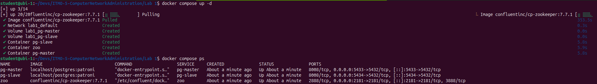

# Лабораторная работа 1. HA Postgres Cluster

Выполнил: Проскуряков Роман Владимирович

## Часть 1. Поднимаем Postgres

<details>
  <summary>Dockerfile</summary>

```
 FROM postgres:15

# Ставим нужные для Patroni зависимости
RUN apt-get update -y && \
	apt-get install -y netcat-openbsd python3-pip curl python3-psycopg2 python3-venv iputils-ping

# Используем виртуальное окружение, доустанавливаем, собственно, Patroni
RUN python3 -m venv /opt/patroni-venv && \
	/opt/patroni-venv/bin/pip install --upgrade pip && \
	/opt/patroni-venv/bin/pip install patroni[zookeeper] psycopg2-binary

# Копируем конфигурацию для двух узлов кластера Patroni
COPY postgres0.yml /postgres0.yml
COPY postgres1.yml /postgres1.yml

ENV PATH="/opt/patroni-venv/bin:$PATH"

USER postgres

#CMD не задаем, т.к. все равно будем переопределять его далее в compose
```
</details>

<details>
  <summary>postgres0.yml</summary>

```
```
</details>

<details>
  <summary>postgres1.yml</summary>

```
```
</details>

<details>
  <summary>haproxy.cfg</summary>

```
```
</details>

Собираем докер образ из докер файла
	
`docker build --no-cache -f Dockerfile -t localhost/postgres:patroni .`

[]()

Запустим контейнеры через docker compose

`docker compose up -d`

Эта команда запустит:
* pg-master (Postgres + Patroni, порт 5433)
* pg-slave (Postgres + Patroni, порт 5434)
* zoo (Zookeeper, порт 2181)

`docker compose ps`

[]()

Узнаём какая из нод стала главной
	docker compose logs pg-master | grep leader
	docker compose logs pg-slave | grep leader

Основной является pg-slave

Проверяем, что зукипер запустился
	docker logs zoo | grep 2181
	
	
# Часть 2

Подключаемся к основной бд (pg-slave)

CREATE TABLE test_table (id int, data varchar);
INSERT INTO test_table VALUES('2', 'data for replic');
SELECT * FROM test_table

Проверяем на реплике (pg-master) - получили те же данные

SELECT * FROM test_table

Пробуем изменить реплику (pg-master) напрямую

INSERT INTO test_table VALUES('3', 'data error');

Получаем ошибку:
ERROR:  cannot execute INSERT in a read-only transaction 

# Часть 3

haproxy.cfg

Удаляем ранее поднятые контейнеры
	docker compose down

И запускаем заново
	docker compose up -d

Через несколько секунд проверяем, что HAproxy работает
	docker logs postgres_entrypoint


Принудительно отключаем мастер:

	docker stop pg-slave


Запускаем старого мастера обратно
	docker start pg-slave


