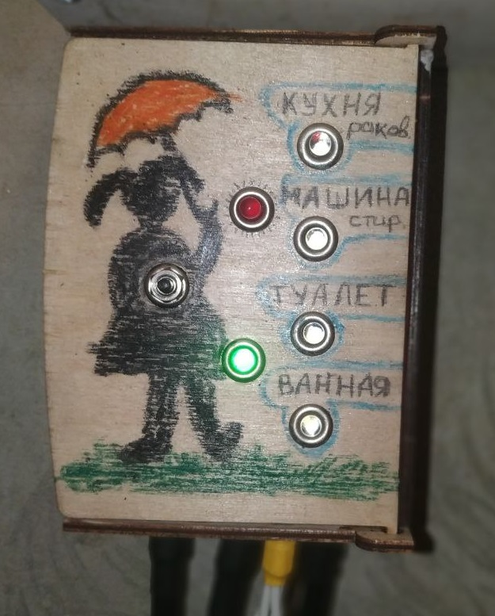
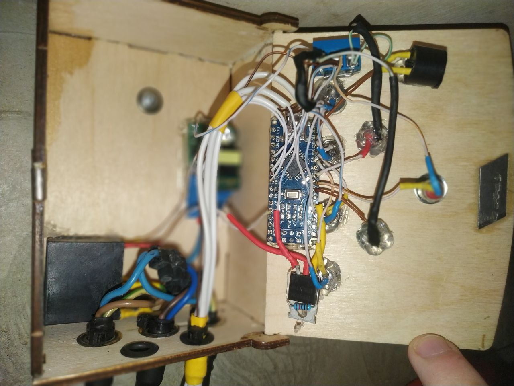
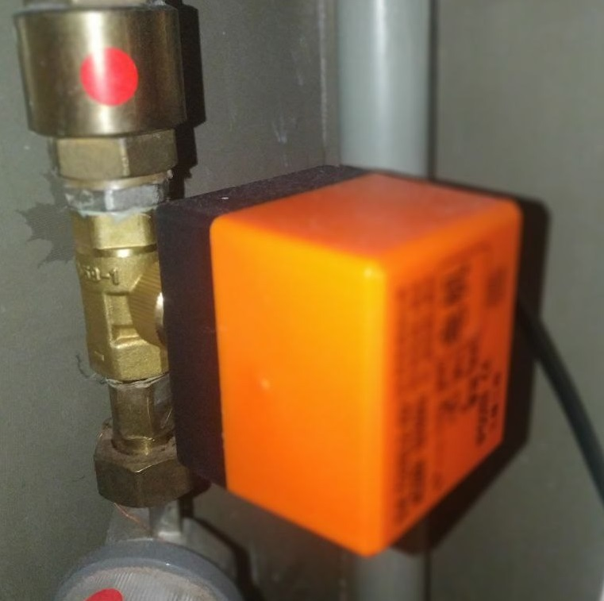

# Устройство для устранения наводнений 

&emsp;&emsp;Под трубами на полу помещены датчики воды. Водопроводные краны с электрическим управлением перекрывают воду в квартире при обнаружении протечки.

## Основная информация

### Стек технологий разработки

1. Arduino IDE: C++ --- прога для микроконтроллера Arduino NANO

### Реализация датчика

&emsp;&emsp;Два провода, расположенные довольно близко друг к другу, но не замкнутые. Если на датчик попадает вода, цепь замыкается, и мы это отслеживаем.

### Корпус

Arduino NANO управляет всем. В корпусе расположены:
1. Индикаторы в виде светодиодов
1. Кнопка для ручного отключения\\включения воды
1. Реле для управления высоковольтными кранами
1. Пищалка для оповещения о протечке
1. и ещё по мелочи (транзистор, сопротивления)

### Кран

## Дата 

&emsp;&emsp;Ноябрь 2023г.

## Заключение

&emsp;&emsp;Система отлично работает, и уже два раза из двух успешно оповестила нас о протечке и отключила воду. 
 