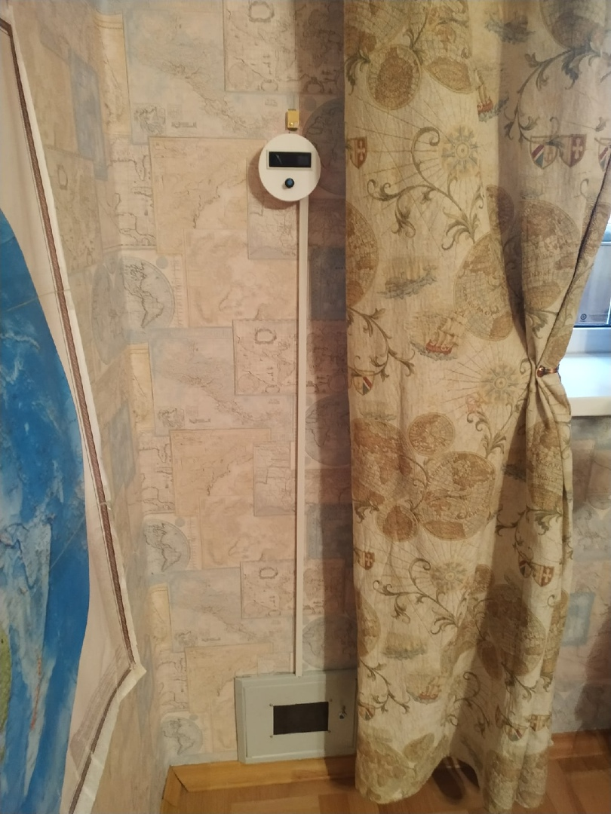

# Проект Бризер

&emsp;&emsp;Название проекта, участвующего в конкурсе "Поддержка научного и инженерного творчества старших классов": "Проектирование, разработка и создание бризера в домашних условиях".\
[ссылка на проект](https://github.com/2romanio005/Brizer/tree/main/Info/Проектирование%2C%20разработка%20и%20создание%20бризера%20в%20домашних%20условиях)

## Основная информация

### Подробную информацию смотри в проекте

[ссылка на проект](https://github.com/2romanio005/Brizer/tree/main/Info/Проектирование%2C%20разработка%20и%20создание%20бризера%20в%20домашних%20условиях)

### Стек технологий разработки

1. Arduino IDE: C++ - прога для МК Arduino nano и ESP8266
1. Visual Studio Code: HTML, CSS, SASS, JS, AJAX, sockets - сайт для бризера (новая версия ещй в производстве)

### Фото

### Адреса моих бризеров

1. Бризер Романа <http://94.242.44.182:56567> \
1. Бризер Borey <http://94.242.44.182:56568>

### Дата 

Изначально был код из начала 2019г. Полностью переписано занаво к концу 2020г. Потом было ещё немного обновлений.

## Заключение

 ${\color{yellow}TODO}$ 1) Новый сайт в затяжной стройке.
 