# Лабораторная работа 2. Loki + Zabbix + Grafana

Выполнил: Проскуряков Роман Владимирович

## Часть 1. Логирование

<details>
  <summary>docker-compose.yml</summary>

```
```
</details>

<details>
  <summary>promtail_config.yml</summary>

```
```
</details>

Запускаем compose файл.

`docker compose up -d`

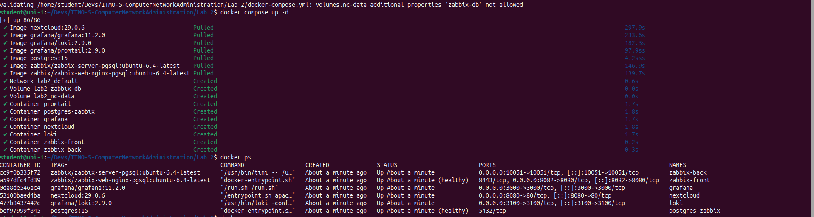

Создаём аккаун в Nextcloud (http://127.0.0.1:8080)

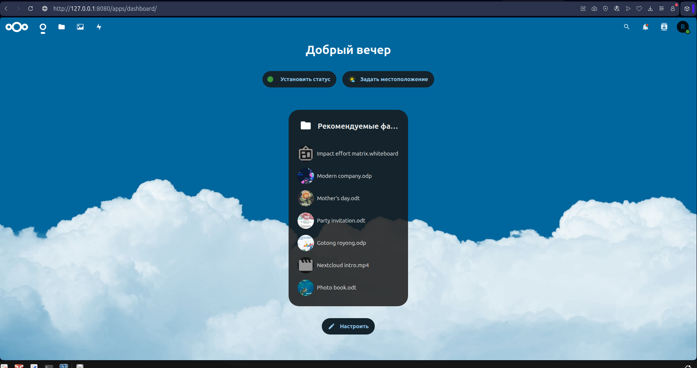

проверяем, что логи “пошли” в нужный нам файл `/var/www/html/data/nextcloud.log`

`docker exec -it nextcloud bash`

`cat data/nextcloud.log`

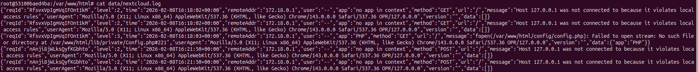

Проверяем в логах promtail, что он “подцепил” нужный нам log-файл: должны быть строчки, содержащие `msg="Seeked /opt/nc_data/nextcloud.log ..."`

`docker compose logs promtail`

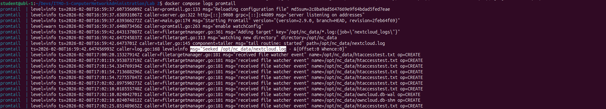

## Часть 2. Мониторинг

<details>
  <summary>template.yml</summary>

```
```
</details>

Подключаемся к веб-интерфейсу Zabbix (http://localhost:8082). Креды *Admin* | *zabbix*

Делаем import кастомного шаблона (template.yml) в zabbix для мониторинга nextcloud.

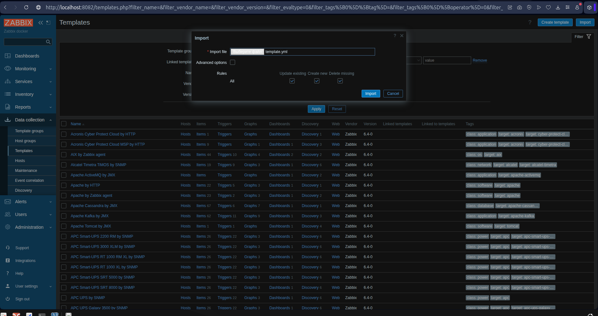

Чтобы Zabbix и Nextcloud могли общаться по своим коротким именам внутри докеровской сети, в некстклауде необходимо “разрешить” это имя. Для этого
нужно зайти на контейнер некстклауда под юзером www-data

`docker exec -u www-data -it nextcloud bash`

и выполнить команду

`php occ config:system:set trusted_domains 1 --value="nextcloud"`

Создаём хоста в Zabbix. Чтобы он знал, что ему слушать.

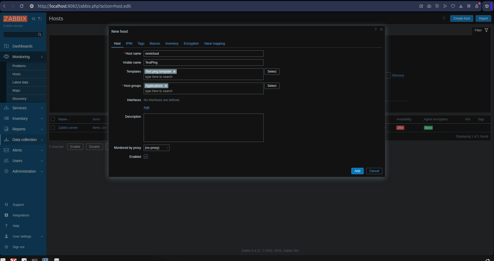

Получаем первые данные с хоста *healhy*


Попробуем нарушить работу тестового сервиса.

`docker exec -u www-data -it nextcloud bash`

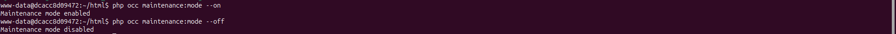

Создаём проблему:

`php occ maintenance:mode --on`

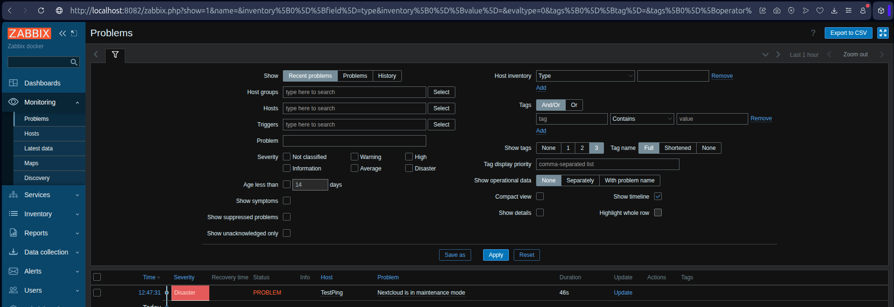

Возвращаем как было.

`php occ maintenance:mode --off`

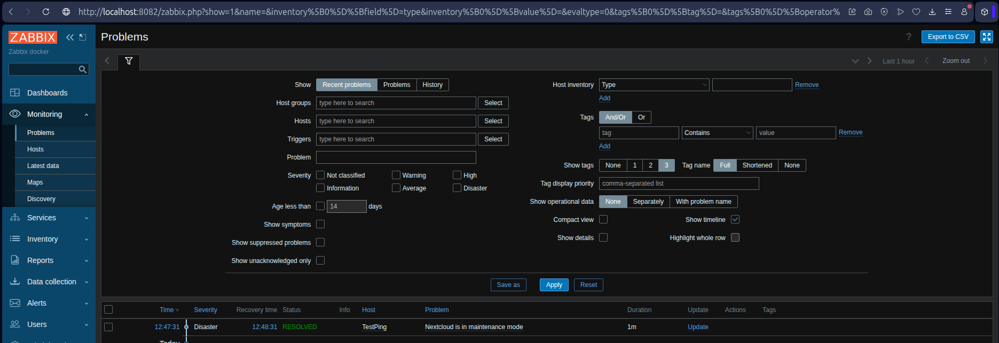

## Часть 3. Визуализация

В Grafana установим плагин Zabbix

Команда устанавливает слишком новую версию Zabbix

~~`docker exec -it grafana bash -c "grafana cli plugins install alexanderzobnin-zabbix-app"`~~

#### Вместо этого установим версию совместимую с grafana:11.2.0

Заходим в контейнер

`docker exec -it grafana bash`

Плагины Grafana лежат в папке `/var/lib/grafana/plugins`

`cd /var/lib/grafana/plugins`

Качаем архив нужной версии (5.2.1 для grafana:11.2.0)

`wget https://github.com/grafana/grafana-zabbix/releases/download/v5.2.1/alexanderzobnin-zabbix-app-5.2.1.zip`

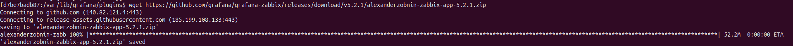

Разархивируем архив

`unzip alexanderzobnin-zabbix-app-5.2.1.zip`

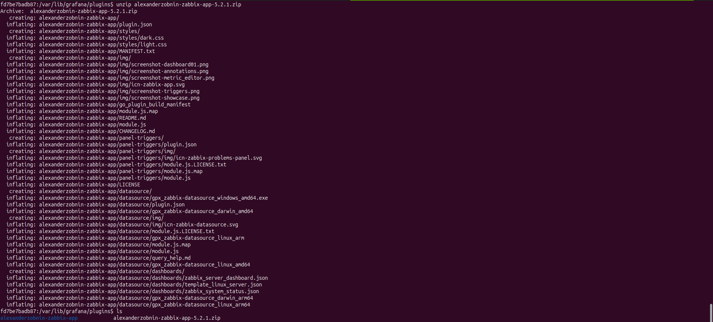

После установки плагина любым из способов нужно выполнить рестарт

`docker restart grafana`


#### Заходим в grafana (http://localhost:3000)

Проверяем что установлена нужная версия

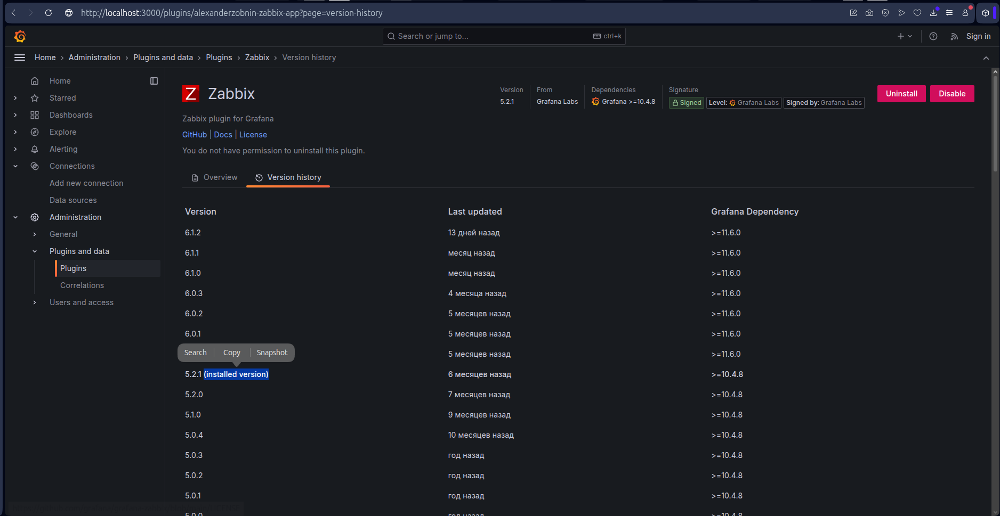

Активируем плагин Zabbix (Enable)

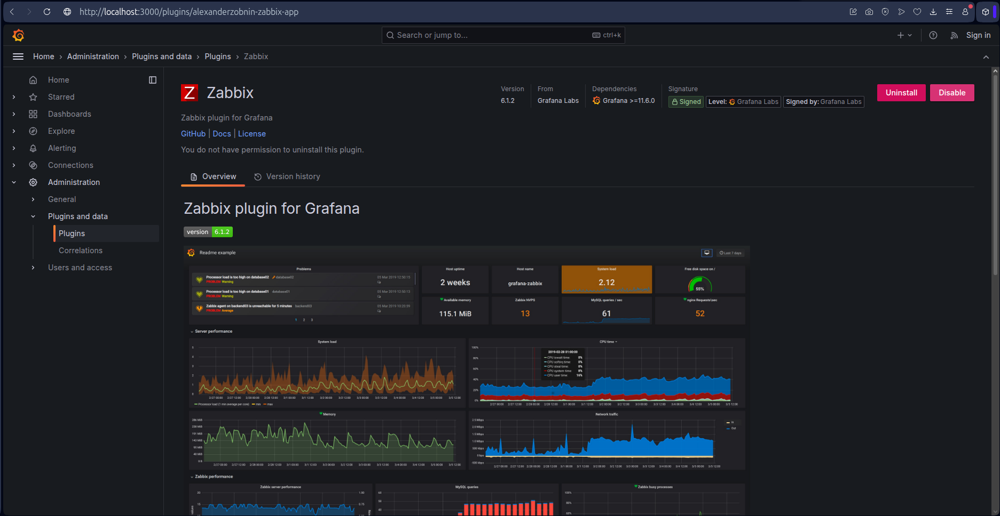

#### Подключаем Zabbix к Grafana (http://zabbix-front:8080/api_jsonrpc.php)

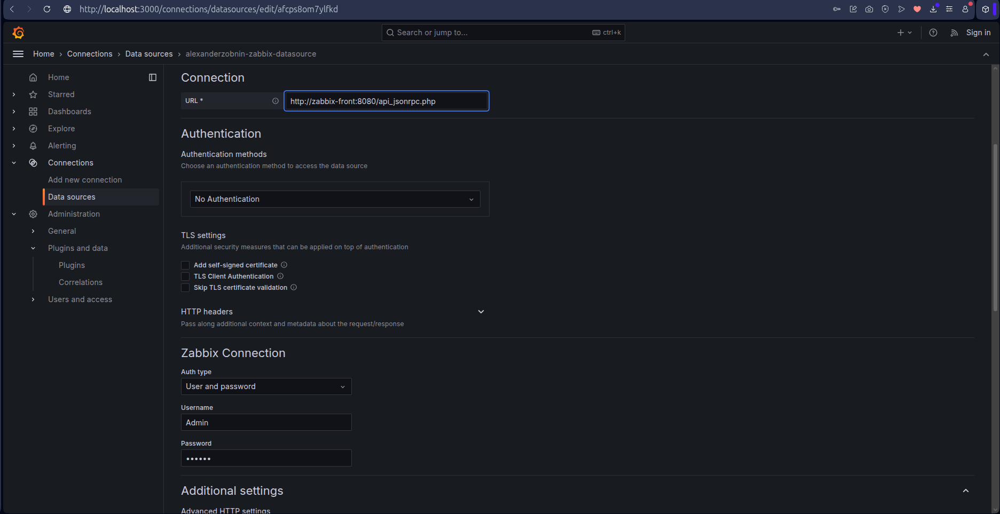

Успешно

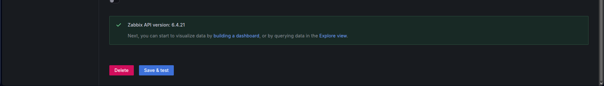

#### Подключаем Loki к Grafana (http://loki:3100)

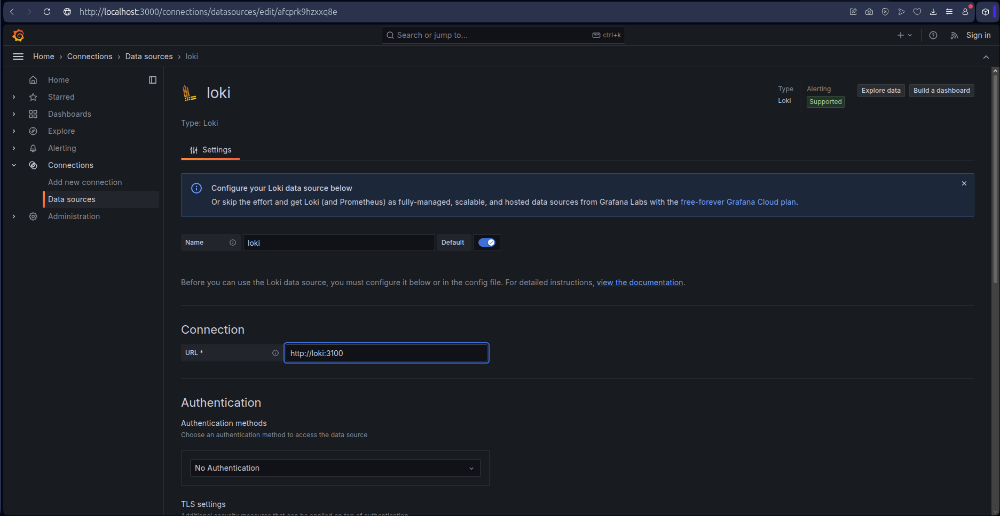

Успешно

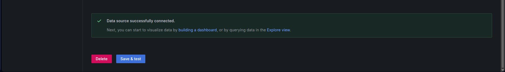

В Explore получаем логи Zabbix

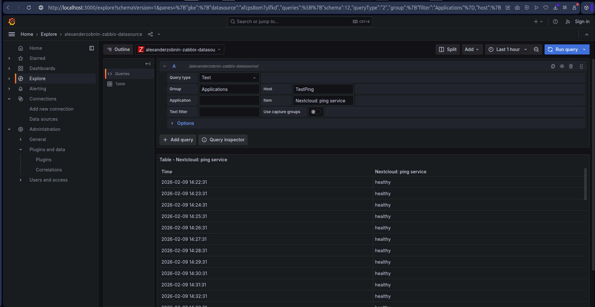

В Explore получаем логи loki

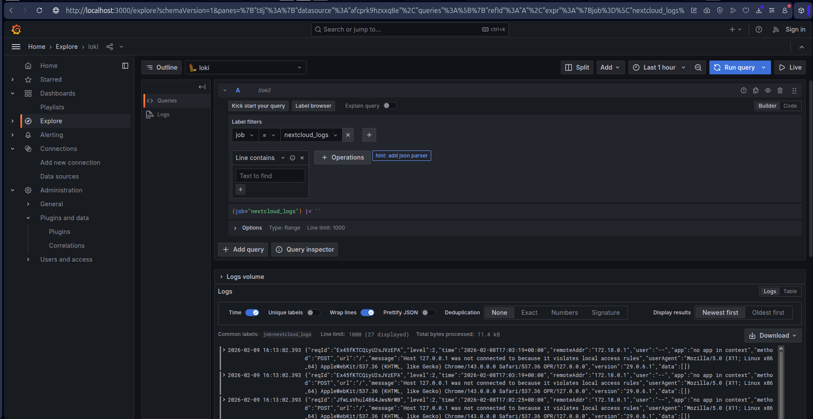

дашборд датасурсов Zabbix - график доступности по времени

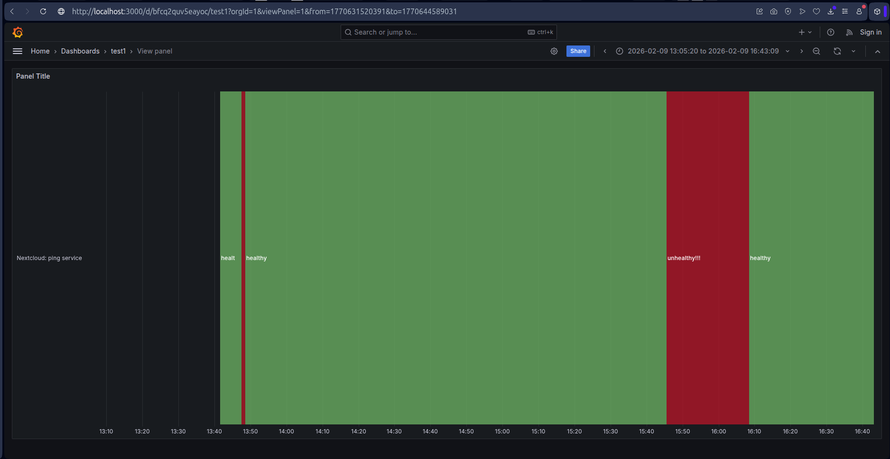

дашборд датасурсов Loki - таблица с логами

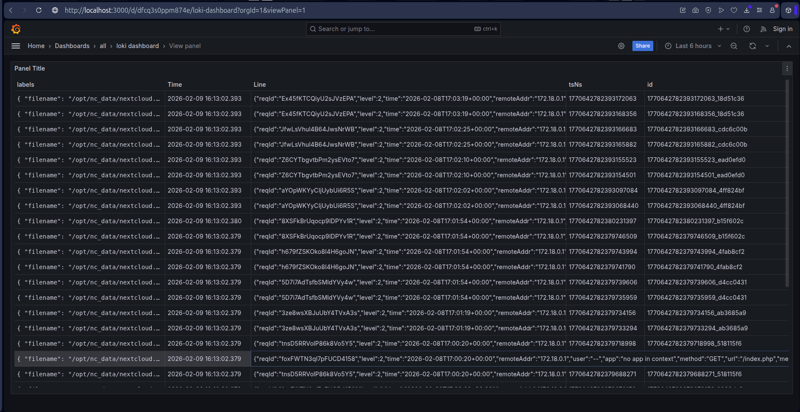

## Ответы на вопросы

### 1. Чем SLO отличается от SLA?

*SLA (Service Level Agreement)* — формальный документ, договор между поставщиком услуги и клиентом. Фиксирует минимально приемлемый уровень работы сервиса и последствия за его невыполнение.

Пример: Облачный сервис гарантирует 99.9% доступности в месяц. Если доступность упадет ниже, клиент получит 10% от месячной платы.

*SLO (Service Level Objective)* — внутренний, измеримый и конкретный целевой показатель для ключевых характеристик сервиса. Позволяет определить, насколько надежным должен быть сервис, чтобы удовлетворять пользователей и с запасом выполнять условия SLA. Это ориентир для принятия инженерных решений.

Пример: "Мы ставим себе внутреннюю цель (SLO) — 99.95% доступности, чтобы с уверенностью гарантировать клиентам (SLA) 99.9%."

### 2. Чем отличается инкрементальный бэкап от дифференциального?

*Инкрементальный* — копирует только изменения, сделанные с момента предыдущего бэкапа ЛЮБОГО ТИПА. Для восстановления нужна цепочка архивов: последний полный и ВСЕ последующие инкрементальные.

*Дифференциальный* — копирует все изменения, сделанные с момента последнего ПОЛНОГО бэкапа. Для восстановления нужны два архива: последний полный и последний дифференциальный.

### 3. В чем разница между мониторингом и observability?

*Мониторинг* — это набор инструментов и практик для слежения за известными метриками и состояниями системы.

*Observability (наблюдаемость)* — это свойство системы, позволяющее по её внешним выводам понимать её внутреннее состояние и находить неизвестные и непредвиденные проблемы.

## Вывод

В ходе лабораторной работы была развернута и настроена система логирования на базе Loki, подключён Zabbix для мониторинга сервиса Nextcloud, выполнена интеграция с Grafana и созданы дашборды. Все компоненты успешно взаимодействуют между собой, обеспечивая наблюдение за сервисом.
