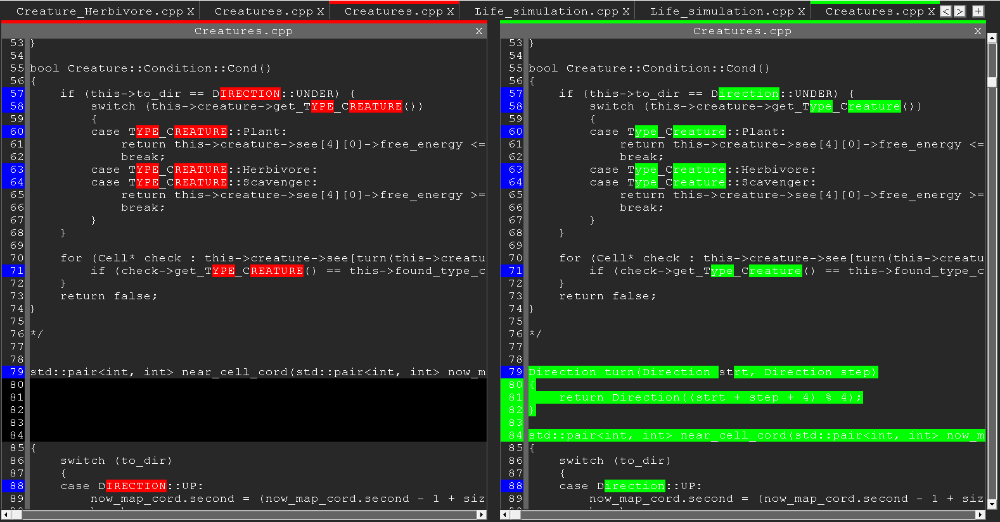
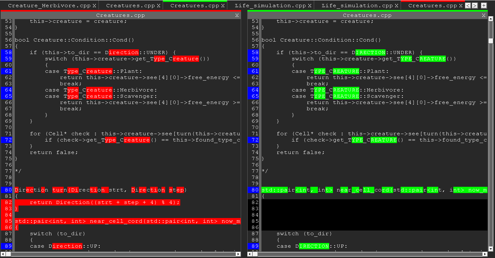

# Сравнение файлов (Графическое, Windows)

&emsp;&emsp;Реализован алгоритм Diff и дальше надо было посимвольно, но мне стало лень.\
&emsp;&emsp;Можно добавлять много файлов, сравнивать их между собой, менять местами, удалять. 

## Фото работы

1. Сейчас сравниваются два разных фала с именем Creatures.cpp. Из левого получаем правый, за счёт удаления всего красного и добавления всего зелёного.

1. Эти же файлы, но наоборот.

## Заключение

Написано на C++, Win API. Конец 2021г.

 ${\color{red}FIXME}$ 1) При табуляции все ёще едет иногда.\
 ${\color{red}FIXME}$ 2) Посимвольно сравнение.\
 ${\color{red}FIXME}$ 3) Иногда не работает горизонтальный скролл.\
 ${\color{yellow}TODO}$ 1) Добавить возможность редактировать.\
 ${\color{yellow}TODO}$ 2) Добавить общий горизонтальный скролл, который скролит оба одновременно.\
 ${\color{yellow}TODO}$ 3) Обработать кнопки pgUp, pgDn, Home, End, стрелочки, увеличить скорость прокрутки по кнопкам.\
 ${\color{yellow}TODO}$ 4) Сделать настройку, чтобы прокручивать не по пиксельно, а по строчно.
 