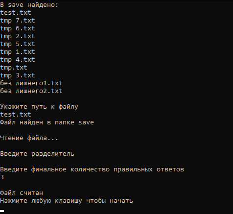
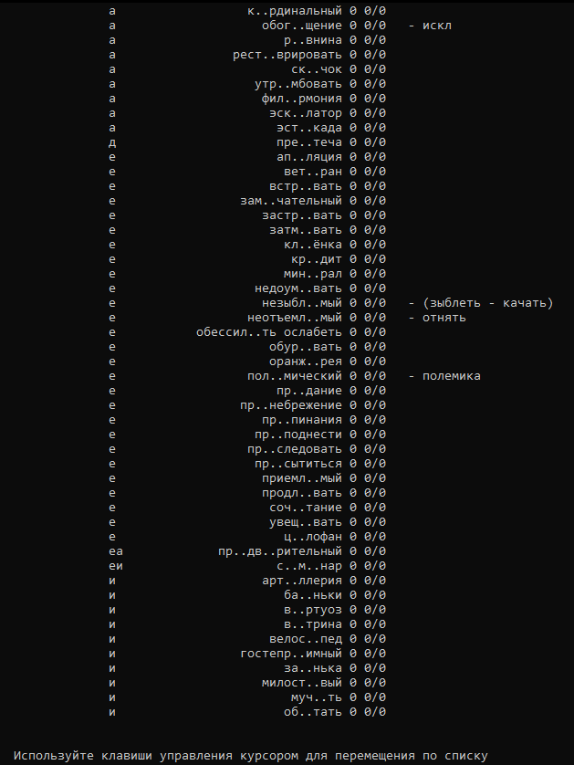
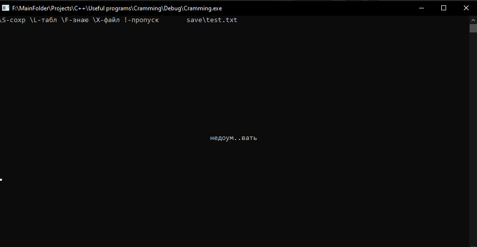
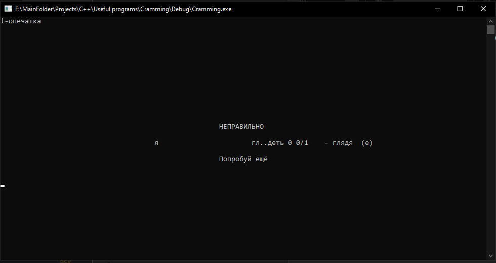

# Заучиватель слов (Консольное приложение)

    Подходит для заучивания слов перед диктантом: словарные слова, неправильные формы глаголов, ударения, исключения

## Фото работы

#### Выбор файла с исходыми данными и некоторых настроек

#### Спиоск всех слов и их прогресс разучвания

#### Программа задаёт вопрос

#### Дан неправильный ответ. Выводится правильный ответ, ваш ответ, и правило, аналогий или подсказка, если вы их указывали

Написано на C++, Консольное приложение. 20--г. Я переписывал это приложение кучу раз.

 ${\color{yellow}TODO}$ 1) Добавить возможность подисывать коментарий к слову после ответа на это слово.\
 