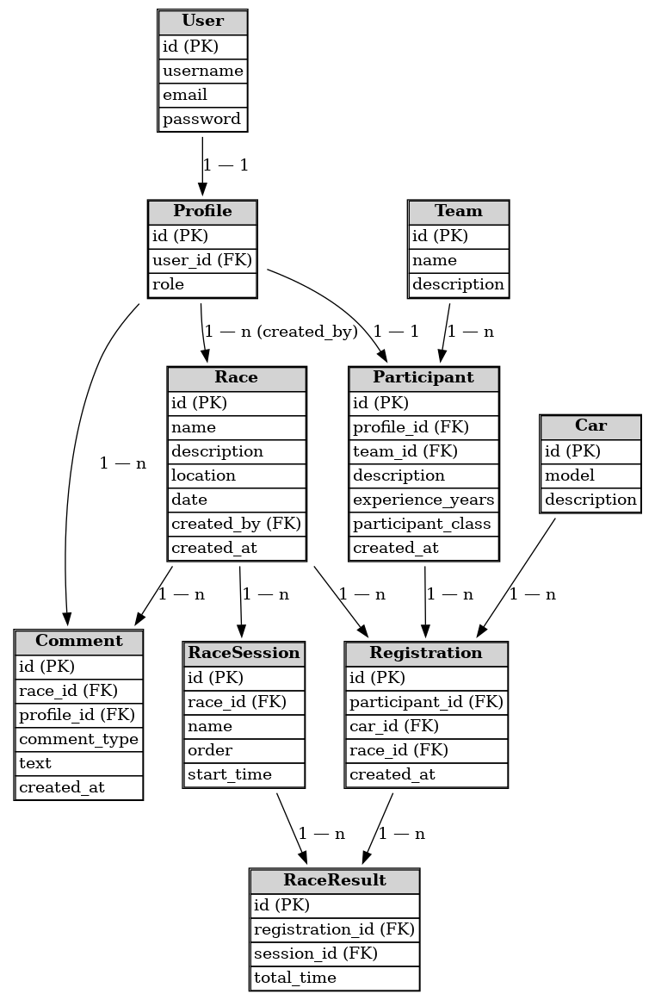

# 🚗 RacingProject — Django приложение для управления автогонками

## Задание "Табло победителей автогонок"

Табло должно отображать информацию об участниках автогонок: 
* ФИО участника, 
* название команды, 
* описание автомобиля, 
* описание участника, 
* опыт и класс участника.
Необходимо реализовать следующий функционал
* Регистрация новых пользователей.
* Просмотр автогонок и регистрацию гонщиков. Пользователь должен иметь возможность редактирования и удаления своих регистраций.
* Написание отзывов и комментариев к автогонкам. Предварительно комментатор должен зарегистрироваться. При добавлении комментариев должны сохраняться 
	* даты заезда, 
	* текст комментария, 
	* тип комментария (вопрос о сотрудничестве, вопрос о гонках, иное), 
	* рейтинг (1-10), 
	* информация о комментаторе. 
* Администратор должен иметь возможность указания времени заезда и результата средствами Django-admin. 
* В клиентской части должна формироваться таблица всех заездов и результатов конкретной гонки.

---

## 🧩 Модели данных

[]()

*Определяют структуру приложения, описывают сущности (гонки, участники, команды, результаты) и связи между ними.*

| Модель               | Назначение                                    | Основные поля                                          |
| -------------------- | --------------------------------------------- | ------------------------------------------------------ |
| **Profile**          | Дополняет стандартного Django пользователя    | `user`, `phone`, связь с `Participant`                 |
| **Participant**      | Представляет пользователя как участника гонок | `profile`, `team`, `car`                               |
| **Team**             | Команда гонщика или группы участников         | `name`, `description`, `owner`                         |
| **Car**              | Автомобиль участника                          | `brand`, `model`, `year`, `number_plate`               |
| **Race**             | Событие гонки                                 | `name`, `location`, `date`, `description`              |
| **RaceSession**      | Отдельная сессия гонки (квалификация, финал)  | `race`, `name`, `order`, `start_time`                  |
| **RaceRegistration** | Регистрация участника на гонку                | `participant`, `race`, `car`, `created_at`             |
| **RaceResult**       | Результат сессии гонки                        | `registration`, `session`, `position`, `best_lap_time` |

---

## 📝 Формы

*Позволяют пользователю вводить и изменять данные через веб-интерфейс.*

| Форма                    | Назначение                                             |
| ------------------------ | ------------------------------------------------------ |
| **ProfileRegistrationForm**      | Регистрация на сайте |
| **ParticipantForm**      | Редактирование данных участника (команда и автомобиль) |
| **CarForm**              | Добавление автомобиля                                  |
| **TeamForm**             | Создание команды                                       |
| **RaceForm**             | Создание гонки (доступно только для админов)                                       |
| **RaceRegistrationForm** | Регистрация участника на гонку                         |
| **RaceSessionForm**       | Добавление заезда в гонку (доступно только для админов)                    |
| **RaceResultForm**       | Добавление результата сессии гонки                     |
| **CommentForm**       | Добавление коментария к гонке                     |

---

## 🌐 URL-адреса и пользовательский функционал

*Для навигации по сайту и выполнения действий была настроена маршрутизация. Описывают точки входа в приложение и определяют, какие страницы и действия доступны пользователю.*

```python
path('', views.races_list, name='races_list')
path('accounts/login/', views.index, name='index')
path('login/', views.AppLoginView.as_view(), name='login')
path('logout/', auth_views.LogoutView.as_view(next_page='racing:races_list'), name='logout')
path('register/', views.register, name='register')
path('participant/create/', views.participant_create, name='participant_create')
path('participant/edit/', views.participant_edit, name='participant_edit')
path('car/create/', views.car_create, name='car_create')
path('team/create/', views.team_create, name='team_create')
path('races/', views.races_list, name='races_list')
path("races/create/", views.race_create, name="race_create")
path('races/<int:pk>/', views.race_detail, name='race_detail')
path('races/<int:race_pk>/register/', views.race_register, name='race_register')
path('races/<int:race_pk>/toggle-registration/', views.race_unregister, name='race_unregister')
path('races/<int:race_pk>/comment/', views.add_comment, name='add_comment')
path('races/<int:race_pk>/race_session_create/', views.race_session_create, name='race_session_create')
path('races/<int:race_pk>/sessions/<int:session_pk>/result/add', views.add_result, name='add_result')
```

**Возможности пользователей:**

* Гость: только просмотр гонок
* Авторизованный пользователь: написание коментариев, стать участником, создать команду участников
* Участник: регистрировать автомобиль для гонки, регистрироваться на гонки
* Админ: создание гонок, заездов и добавление результатов заездов

---

## 🛠 Представления (Views)

*Обрабатывают запросы, взаимодействуют с моделями и формами, возвращают шаблоны.*

Пример регистрации автомобиля

```python
@login_required
def car_create(request):
    if request.method == 'POST':
        form = CarForm(request.POST)
        if form.is_valid():
            car = form.save()
            return redirect('racing:races_list')
    else:
        form = CarForm()
    return render(request, 'racing/car_form.html', {'form': form})
```

Пример редактирование участника:

```python
@login_required
def participant_edit(request):
    profile = request.user.profile
    participant = profile.participant

    if request.method == "POST":
        form = ParticipantForm(request.POST, instance=participant)
        if form.is_valid():
            form.save()
            return redirect("racing:races_list")

    else:
        form = ParticipantForm(instance=participant)

    return render(request, "racing/participant_edit.html", {"form": form})
```

---

## 🧰 Панель администратора

Все модели зарегистрированы в `admin.py`, и доступны для редактирования через Django Admin.

Администратор может:

* Напрямую взаимодействовать с объектам БД из панели /admin/
* Добавлять/редактировать гонки
* Управлять заездами гонок
* Заносить результаты гонок

Для администартора добавляются кнопки на самом сайте и используется стандартная панель Django, доступная по:

```
/admin/
```
