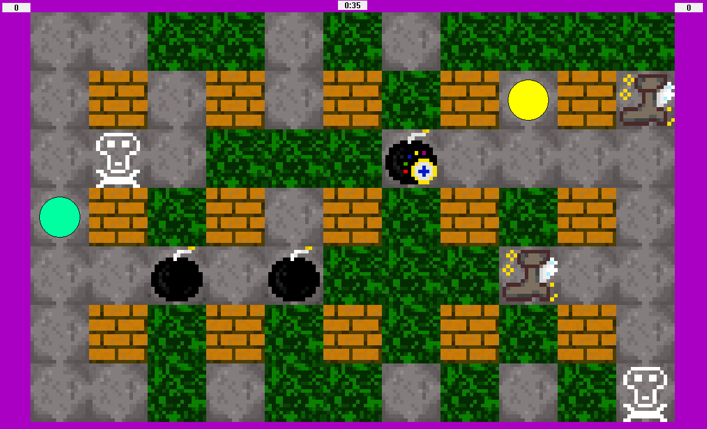

# Игра "Бомбер" для двух человек для windows.

### Геймплей

### Управление
&emsp;После нажатий на клавиши движений, движеий записываются в буффер и ваш персонаж постепенно движется по ним. 
&emsp;Игрк 1: 
&emsp;&emsp;"стрелочки (arrows)" - движение 
&nbsp;&nbsp;"ввод (enter)" - поставить бомбу 
		"\\" - очистить буфер движений 
&nbsp;Игрок 2: 
		"wasd" - движения 
		"пробел (space)" - поставить бомбу 
		"c" - очистить буфер движений 

Написано на C++, Win API