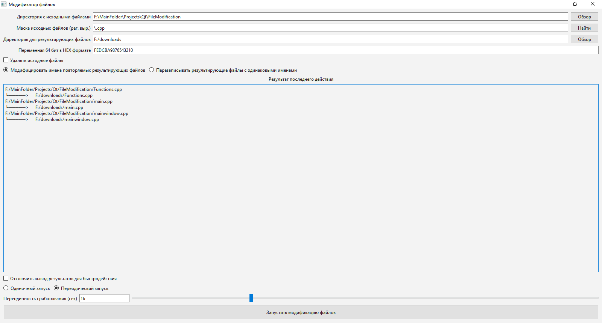

# $\mathbb{\color[RGB]{255,60,0}{Массовый Шифратор файлов через XOR \ (Графич, \ Windows)}}$

Просто pet-проект на Qt, попечённый Win Api. Шифрует файлы через XOR с вводимым 64 битным ключом. Для расшифровки надо получившиеся файлы ещё раз тем же ключём жахнуть.

## $\mathbb{\color[RGB]{255,90,0}{Основная \ информация}}$

### $\mathbb{\color[RGB]{255,127,0}{Стек \ технологий \ разработки}}$

- Язык $\mathbb{\color[RGB]{252,193,83}{C++}}$
	+ библиотека $\mathbb{\color[RGB]{252,193,83}{Qt}}$.
	+ библиотека $\mathbb{\color[RGB]{252,193,83}{Win \ Api}}$. Для работы с файлами в эксклюзивном режиме.

### $\mathbb{\color[RGB]{255,127,0}{Среда \ разработки}}$

- Qt Creator 13.0.0

### $\mathbb{\color[RGB]{255,127,0}{Фото \ работы}}$

## $\mathbb{\color[RGB]{255,90,0}{Дата}}$

&emsp;&emsp; $\mathbb{\color[RGB]{252,193,83}{17-19 \ мая \ 2024}}$

## $\mathbb{\color[RGB]{255,90,0}{Заключение}}$

&emsp;&emsp;Оно работает но я не особо его тестировал. Вы можете скачать его в [релизах]https://github.com/2romanio005/FileModification/releases/latest), если вам вдруг нтересно.

${\color{yellow}TODO}$ 1) Протестировать что происходит когда размер файла не кратен 64 битам, можно ли его расшифровать после этого.
