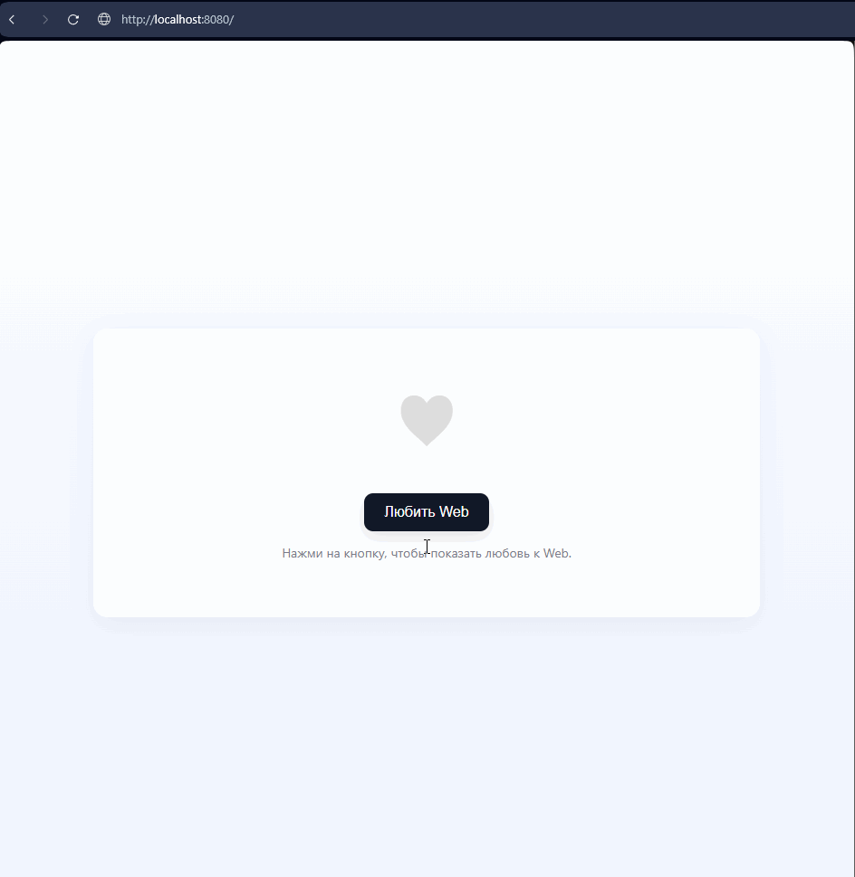

### Выполнил: $\mathbb{\color[RGB]{255,60,0}{Проскуряков \ Роман \ Владимирович \ K3239}}$

# Рубежная работа 1. Вариант 1.

## Задание 1

Консоль приложения сервера

Консоль приложения клиента

Ничего особенного, просто "Hello world!" в сетевом мире.

## Задание 2

В нашем варианте требуется проводить вычисления по теореме Пифагора.

1. Вычислить гипотенузу по двум катетам

	

2. Вычислить катет по гипотенузе и другому катету

	

3. Можно разорвать соединение, и после этого приложение клиента завершается

	

Консоль сервера после предыдущих запросов

Сервер поддерживает паралельную обработку запросов за счёт разпределения клиентов по потокам.

## Задание 3

Запустим сервер на localhost:8080

## Задание 4

## Задание 5

# Рубежная работа 1. Вариант 1.

## Зачем в облаке предусмотрено столько регионов? Зачем там кроме регионов еще и зоны?

### Облачные регионы

Облачный регион - географическая территорию с дата-центрами облачного провайдера. Каждый регион обособлен и автономен. Данные между регионами данные не дублируются.

Регионы полезны по нескольким причинам:
* Скорость

Провайдеры размещают дата-центры в непосредственной близости к своим клиентам. Покупателям позволяется выбирать, где именно будут храниться их данные и работать приложения.

* Юридические

Законы обычно требуют, чтобы персональные сведения хранились на серверах, расположенных внутри государства. Регионы позволяют отслеживать выполнение этого требования.

* Аварийное восстановление данных

Многие провайдеры открывают по два региона в каждой стране присутствия и при необходимости могут вручную оперативно перенести данные.

### Зоны доступности

Один регион содержит в себе одну или несколько зон.

Зона доступности - это отдельные дата-центров внутри региона, объединённые высокопропускными линиями связи. Зоны также связаны и между собой внутри одного региона.
Основная цель зоны - отказоустойчивость.
Отказоустойчивость обеспечивается не за счёт более качественного обустройства и оборудования дата-центров, а за счёт их взаимозаменяемости. В случае неполадок в одной из зон ресурсы становятся доступны из других.

Так поддерживается высокая доступность приложений, что важно для пользователей.

### Заключение

Регионы и зоны доступности играют решающую роль в обеспечении гибкости, отказоустойчивости, соответствия требованиям и масштабируемости. Они удобны и для использующих их организаций, и для развития самих облачных сервисов.

# Рубежная работа 2. Вариант 4. 

## Какие есть способы экономить в облаке? Объясните подробно разницу между моделью использования по требованию (on demand) и резервацией мощностей (reserved). Есть ли другие модели использования облака?

Экономия за счёт облака делится на две части.
1. Экономия за счёт отказа от покупки и поддержки личных серверов за счёт снижения рисков человеко-часов на настройку.

2. Выбора минимально необходимого тарифа и правильной модели оплаты. Платить надо только за то, что вы используете.

### Модель "резервация мощностей" (reserved)
Эта модель тарификации предполагает, что клиент оплачивает фиксированную сумму за доступ к определённому количеству ресурсов. Цена формируется до использования облачного сервиса. В течении оплаченного времени количество доступных ресурсов не меняется
Обычно чем дольше срок, тем дешевле. Платить приходится увеличением рисков за счёт малой гибкости модели. В случае непредвиденного изменения потребностей может потребоваться пересмотр условий контракта или переход на другой тариф.

### Модель "по требованию" (Pay-as-You-Go (PAYG))
Модель PAYG позволяет клиентам оплачивать только те ресурсы, которые они фактически используют. Цена выставляется уже после фактического использования каких-либо ресурсов. 
Пользователь практически не имеет ограничений и может прекратить использование в любое время. Такая модель идеально подходит для непредсказуемых рабочих нагрузок, запуска стартапов и разработки новых приложений.
Недостатками модели являются большая стоимость за единицу ресурса и непредсказуемые суммы выставления счетов.

### Другие модели
Я смог найти две ещё не рассмотренные модели:

* "Спотовая" модель 

В этой модели вы покупаете простаивающие в данный момент ресурсы. Цена формируются от спроса и предложения, и пользователи могут участвовать в торгах за неиспользуемые облачные мощности по потенциально более низким ценам.
Такая модель подходит для кратковременных вычислений, которые могут терпеть перерывы.

* Модель "Гибридного облака"

Эта модель сочетает в себе локальную инфраструктуру (частное облако) и общедоступный облачный сервис. Конфиденциальный вычисления происходят внутри компании, а внешний сервис используется для масштабируемых задач с высоким спросом.
Недостатком является сложность управления и интеграции.

Думаю, есть и другие модели.

# $\mathbb{\color[RGB]{255,60,0}{Проект \ Бризер}}$

&emsp;&emsp;Название проекта, $\mathbb{\color[RGB]{252,193,83}{победившего}}$ в конкурсе "Поддержка научного и инженерного творчества старших классов" при $\mathbb{\color[RGB]{252,193,83}{правительстве \ Санкт-Петербурга}}$ 2021г. - "Проектирование, разработка и создание бризера в домашних условиях".\
&emsp;&emsp;[Ссылка на проект](Info/Проектирование%2C%20разработка%20и%20создание%20бризера%20в%20домашних%20условиях)

## $\mathbb{\color[RGB]{255,90,0}{Основная \ информация}}$

### $\mathbb{\color[RGB]{255,127,0}{Подробную \ информацию \ смотри \ в \ проекте}}$

&emsp;&emsp;[Ссылка на проект](Info/Проектирование%2C%20разработка%20и%20создание%20бризера%20в%20домашних%20условиях)

### $\mathbb{\color[RGB]{255,127,0}{Стек \ технологий \ разработки}}$

- $\mathbb{\color[RGB]{252,193,83}{C++}}$ --- прога для микроконтроллера(МК) Arduino NANO ($\mathbb{\color[RGB]{252,193,83}{ATmega328p}}$)
	+ Жёсткая и тщательная $\mathbb{\color[RGB]{252,193,83}{оптимизация \ кода}}$, чтобы он влез в память 32КБ Flash, 2КБ оперативной, 1КБ энергонезависимой EEPROM.
	+ $\mathbb{\color[RGB]{252,193,83}{WatchDog}}$.
	+ $\mathbb{\color[RGB]{252,193,83}{Прерывания}}$.
	+ Много $\mathbb{\color[RGB]{252,193,83}{шаблонов}}$.
	+ Много функций, мало ООП.
- $\mathbb{\color[RGB]{252,193,83}{С++}}$ --- прога для МК $\mathbb{\color[RGB]{252,193,83}{ESP8266}}$ (Tensilica’s L106)
	+ $\mathbb{\color[RGB]{252,193,83}{Сервер}}$ на С++.
	+ $\mathbb{\color[RGB]{252,193,83}{HTTP, \ FTP}}$ протоколы
	+ Общение с Arduino по $\mathbb{\color[RGB]{252,193,83}{UART(RX/TX)}}$ протоколу.
- HTML, CSS, SASS, JS, AJAX, web sockets --- сайт для бризера (новая версия ещё в производстве)
	+ Работа с $\mathbb{\color[RGB]{252,193,83}{CORS}}$ запросами.
- $\mathbb{\color[RGB]{252,193,83}{Схемотехника}}$
	+ Много проводов
	+ Учимся паять
	
### $\mathbb{\color[RGB]{255,127,0}{Среды \ разработки}}$

- Arduino IDE
- Visual Studio Code

### $\mathbb{\color[RGB]{255,127,0}{Фото}}$

### $\mathbb{\color[RGB]{255,127,0}{Адреса \ моих \ бризеров}}$

1. Бризер Романа <http://94.242.44.182:56567>
1. Бризер Borey <http://94.242.44.182:56568>

## $\mathbb{\color[RGB]{255,90,0}{Дата}}$

&emsp;&emsp;Изначально был код из начала 2019г. Полностью переписано заново к $\mathbb{\color[RGB]{252,193,83}{концу \ 2020г.}}$ Потом было ещё немного обновлений.

## $\mathbb{\color[RGB]{255,90,0}{Заключение}}$

 ${\color{yellow}TODO}$ 1) Новый сайт в затяжной стройке.
 